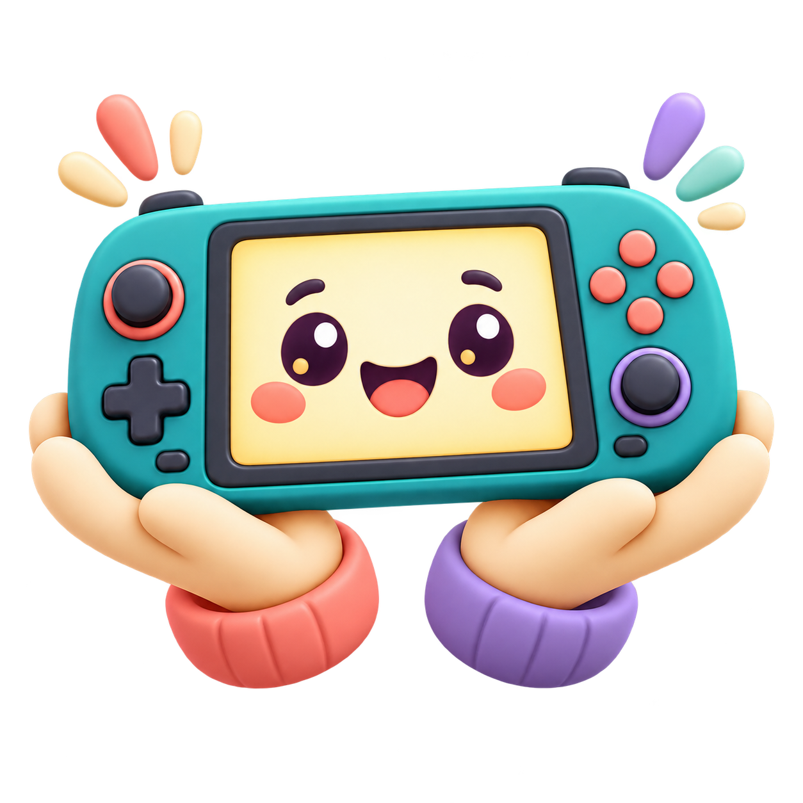

# Handholder



[](https://github.com/viticci/handholder/actions/workflows/validate.yml)

Handholder is a Codex skill for setting up Android gaming handhelds safely. It can inspect a connected device, install a frontend and emulators, move a lawful game library and saves, and verify that the result works from the controller.

It has tested guidance for the AYN Thor and Retroid Pocket Nova. Other Android handhelds use the same cautious workflow and can gain their own small device profile.

## Install Handholder

Ask Codex:

> Install the Handholder skill from https://github.com/viticci/handholder

Start a new Codex task after installation so the skill list refreshes. If you maintain skills manually, clone this repository as `handholder` inside your Codex skills directory.

## What it handles

- Safe ADB discovery with explicit device selection
- Cocoon setup, platform mapping, artwork scraping, and launch tests
- RetroArch and standalone emulators
- Internal or removable storage layouts
- ROM, BIOS, and save migration from user-supplied backups
- Controller, display, aspect-ratio, audio, suspend, and resume checks
- Single-screen and multi-screen handhelds

Handholder does not download commercial ROMs, BIOS files, keys, or other copyrighted game data.

## Quick start for people

1. Install Android Platform Tools so `adb` is available.
2. Enable Developer options and USB debugging on the handheld.
3. Connect it by USB and approve the debugging prompt on the device.
4. Tell Codex what storage to use, which systems to include, and where your lawful backups are.
5. Ask: `Use $handholder to set up my handheld.`

Handholder inventories and backs up relevant data before it replaces, clears, or removes anything. It also measures the library before copying it, so a large disc collection cannot silently fill the device.

## Quick start for agents

Read [SKILL.md](SKILL.md) first. Then:

1. Run `bash scripts/probe-device.sh [serial]`.
2. Read `references/device-and-adb.md`.
3. Read only the matching file in `references/devices/`.
4. Load the Cocoon, emulator, or save references only when those parts are in scope.
5. Verify current releases from official sources; profile versions are never authoritative.
6. Test a representative game for every configured system from the frontend.
7. Run `bash scripts/validate-public.sh` before publishing changes.

The skill must not contain a person's home path, device serial, credentials, ROM filenames, or assumptions copied from one setup session.

## Repository map

```text
handholder/
├── SKILL.md                         Main agent workflow and safety rules
├── README.md                        Human and agent introduction
├── agents/openai.yaml               Skill picker metadata
├── assets/handholder-icon.png       Project icon
├── scripts/probe-device.sh          Read-only ADB inventory
├── scripts/validate-public.sh       Public-data hygiene check
└── references/
    ├── device-and-adb.md            Displays, input, storage, and UI safety
    ├── cocoon.md                    Frontend setup and scrape verification
    ├── emulators.md                 Emulator and core selection
    ├── saves-and-native-ports.md    Save matching and native ports
    └── devices/                     Small model-specific profiles
```

## Adding a handheld

Start with the generic workflow. Add a profile only for facts that live probing or hands-on testing proves are model-specific, such as multiple physical displays, unusual controller modes, or vendor performance controls. Keep paths, package versions, and input-event numbers dynamic.

## Validate a contribution

```sh
bash scripts/validate-public.sh
python3 /path/to/skill-creator/scripts/quick_validate.py .
```

Keep changes small and evidence-based. A process being open is not proof that a game is playable; Handholder finishes with visible gameplay, working controls, correct display ownership, and a frontend launch test.
